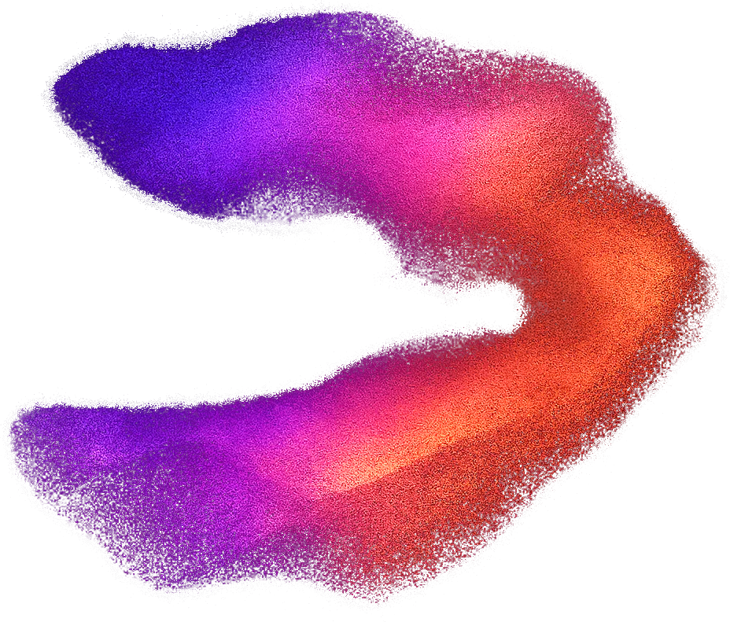

<p align="center">
  
</p>

<h1 align="center">noder</h1>

<p align="center">
  <strong>A local-first desktop canvas for chaining AI media workflows</strong>
</p>

<p align="center">
  <a href="#features">Features</a> |
  <a href="#installation">Installation</a> |
  <a href="#quick-start">Quick Start</a> |
  <a href="#development">Development</a> |
  <a href="#release-process">Release Process</a>
</p>

<p align="center">
  
  
  
  
</p>

---

## Overview

**noder** is an open-source Tauri desktop app for building creative AI workflows on a
visual node canvas. You can connect text, image, video, audio, media, chip, upscaler,
markdown, and display nodes, then run the graph locally with your own provider keys.

The app is built with React 18, Vite, React Flow, Rust, and Tauri 2. Workflows,
settings, downloaded outputs, and credentials stay on your machine. API calls go only
to the providers you configure.

---

## Features

- **Visual workflow canvas** - drag, connect, group, duplicate, align, and execute
  nodes on a React Flow canvas with minimap, editor toolbar, and keyboard shortcuts.
- **Provider-backed generation** - text, image, video, audio, and upscaling nodes can
  use configured cloud and local model providers.
- **Reusable prompt chips** - define named values such as `STYLE` or `CHARACTER` and
  inject them into connected prompts with placeholders like `__STYLE__`.
- **Templates for real workflows** - start from character sheets, product photo sets,
  thumbnail generation, editorial image series, storyboards, campaign assets, and
  animation keyframes.
- **Output review tools** - generated media appears in node previews and in the output
  gallery/filmstrip for scanning, comparing, and opening assets.
- **Assistant panel** - OpenRouter-backed assistant with model search, recent models,
  featured models, and tool-aware workflow context.
- **Local-first storage** - saved workflows use the app data directory; generated and
  downloaded media defaults to `Downloads/noder`.
- **Secure key handling** - desktop settings load API keys from the operating system
  credential store and migrate older plaintext settings when possible.
- **Update and release hardening** - release assets include SHA-256 manifests, and the
  in-app updater verifies platform checksums before marking downloaded updates ready.
- **Cross-platform release builds** - CI publishes Windows zip/portable artifacts and
  macOS app/DMG artifacts. Windows signing is optional; macOS builds are signed and
  notarized when Apple credentials are configured.

---

## Installation

### Download a Release

Download the latest build from the [GitHub Releases](https://github.com/oshtz/noder/releases)
page.

| Platform | Asset | Notes |
| --- | --- | --- |
| Windows | `noder-win.zip` | Recommended Windows download; extract and run `noder.exe`. |
| Windows | `noder-portable.exe` | Single-file portable executable. |
| macOS | `noder_<version>_aarch64.dmg` | Apple Silicon DMG from the current CI build. |
| macOS | `noder.app.zip` | Zipped app bundle used by releases and updater checks. |
| Checksums | `SHA256SUMS-windows.txt`, `SHA256SUMS-macos.txt` | SHA-256 manifests for release assets. |

**Windows:** prefer `noder-win.zip` if SmartScreen or antivirus tools are sensitive to
single-file packed executables. The portable build is produced with Enigma Virtual Box
and may trigger stricter heuristics when unsigned.

**macOS:** open the DMG and drag `noder.app` to Applications, or unzip `noder.app.zip`
directly. Current release automation publishes Apple Silicon macOS artifacts.

### Verify Downloads

Windows:

```powershell
Get-FileHash -Algorithm SHA256 .\noder-win.zip
Get-Content .\SHA256SUMS-windows.txt
```

macOS:

```bash
shasum -a 256 noder*.dmg noder.app.zip
cat SHA256SUMS-macos.txt
```

---

## Quick Start

1. Launch noder.
2. Open Settings and add the API keys or local service URLs for the providers you want
   to use.
3. Start from a template or double-click the canvas to open the node selector.
4. Add a node, enter a prompt, connect any inputs, and run the workflow.
5. Review results in the node preview, filmstrip, or Output Gallery.

Useful first workflows:

- **AI Prompt Generator** - text node expands an idea into an image prompt.
- **Character Concept Sheet** - chip node feeds a consistent character description to
  multiple image nodes and upscalers.
- **Product Photo Suite** - chip-driven product description with hero and lifestyle
  image outputs.
- **Storyboard Sequence** - consistent character and scene frames across multiple
  image nodes.

---

## Providers

Provider availability depends on the key or local service URL you configure in
Settings.

| Provider | Used For | Configuration |
| --- | --- | --- |
| OpenRouter | Assistant panel and default text model routing | OpenRouter API key |
| OpenAI | Text models through the desktop backend | OpenAI API key |
| Anthropic | Claude text models through the desktop backend | Anthropic API key |
| Google Gemini | Gemini text models | Gemini API key |
| Ollama | Local text models | Ollama base URL, default `http://localhost:11434` |
| LM Studio | Local OpenAI-compatible text models | LM Studio base URL, default `http://localhost:1234` |
| Replicate | Image, video, audio, upscaling, media uploads | Replicate API key |
| fal.ai | Image, video, audio model discovery/execution paths | fal API key |

Default models are stored in Settings and can be changed per node. Current defaults
include OpenRouter `openai/gpt-4o-mini` for text, Replicate `black-forest-labs/flux-2-klein-4b`
for image, `lightricks/ltx-2-fast` for video, `google/lyria-2` for audio, and
`recraft-ai/recraft-crisp-upscale` for upscaling.

---

## Node Types

| Node | Purpose |
| --- | --- |
| Text (LLM) | Generate text from prompts and optional system prompts. |
| Image | Generate images from text or connected text/chip inputs. |
| Video | Generate video from prompts and optional image/video inputs. |
| Audio | Generate music, speech, or sound from prompts. |
| Upscaler | Enhance or upscale generated or connected images. |
| Media | Import local image, video, or audio assets into the workflow. |
| Chip | Reusable text value for prompt placeholders such as `__CHARACTER__`. |
| Display Text | Show text output on the canvas. |
| Markdown | Render markdown content on the canvas. |
| Group | Organize selected nodes visually. |

---

## Keyboard Shortcuts

| Shortcut | Action |
| --- | --- |
| Double-click canvas | Open node selector |
| Delete / Backspace | Delete selected nodes |
| Ctrl+D | Duplicate selected nodes |
| Ctrl+C | Copy selected nodes |
| Ctrl+V | Paste nodes |
| Ctrl+G | Group selected nodes |
| Ctrl+Shift+G | Ungroup selected group |
| Ctrl+Enter | Run workflow |

On macOS, use `Cmd` instead of `Ctrl`.

---

## Data Storage

- **Saved workflows:** Tauri app data directory, under `workflows/`.
- **Settings:** Tauri app data directory.
- **API keys:** operating system credential store when running in the desktop app.
- **Generated/downloaded media:** defaults to `Downloads/noder`.
- **Uploads:** defaults to `Downloads/noder/uploads`.
- **WhatsApp service data:** app data directory, under `whatsapp/`, when that backend
  integration is active.

The web-only Vite shell uses browser/runtime fallbacks for development. Tauri-only
features such as credential storage, local file commands, updater checks, and backend
provider calls require the desktop runtime.

---

## Development

### Prerequisites

- Node.js `^20.19.0` or `>=22.12.0`; CI uses Node 22.
- npm.
- Rust stable through [rustup](https://rustup.rs/).
- Platform build dependencies required by Tauri.

### Commands

```bash
git clone https://github.com/oshtz/noder.git
cd noder
npm ci
```

```bash
# Start the desktop app in development mode
npm run start

# Run the Vite web shell only
npm run dev

# Typecheck and build the frontend
npm run build

# Run tests
npm run test:run

# Run focused CI smoke tests
npm run test:smoke

# Check formatting
npm run format:check

# Build the Tauri app
npm run tauri:build
```

### Project Structure

```text
noder/
|-- src/                    # React frontend
|   |-- api/                # Frontend API clients and provider helpers
|   |-- components/         # UI components
|   |-- hooks/              # Workflow, UI, assistant, and persistence hooks
|   |-- nodes/              # Node registry and node components
|   |-- stores/             # Zustand stores
|   |-- utils/              # Workflow, logging, model, and runtime utilities
|   `-- constants/          # Shared UI and connection constants
|-- src-tauri/              # Rust/Tauri backend
|   |-- src/                # Commands, settings, updates, file handling
|   `-- capabilities/       # Tauri permissions
|-- docs/                   # Release checklist and operational docs
|-- scripts/                # CI/release verification scripts
|-- public/                 # Static assets
`-- .github/workflows/      # Build and release automation
```

---

## Release Process

The release workflow validates on normal `main` and `codex/**` pushes. Windows and
macOS packaging jobs run for `v*` tag pushes and manual workflow dispatches.

Version alignment is enforced across:

- `package.json`
- `package-lock.json`
- `src-tauri/Cargo.toml`
- `src-tauri/Cargo.lock`
- `src-tauri/tauri.conf.json`

Release checks include workflow smoke tests, release prerequisite tests, version
alignment, artifact verification tests, frontend build, npm audit, and Rust `cargo check`.
Published release assets can be verified with:

```bash
npm run verify:release-artifacts -- v0.1.6
```

For the step-by-step release checklist, see [docs/release-checklist.md](docs/release-checklist.md).

---

## Contributing

1. Fork the repository.
2. Create a feature branch.
3. Make focused changes and include tests where behavior changes.
4. Run the relevant local checks.
5. Open a pull request.

---

## License

This project is licensed under the MIT License. See [LICENSE](LICENSE) for details.

---

## Acknowledgments

- [React Flow](https://reactflow.dev/)
- [Tauri](https://tauri.app/)
- [Replicate](https://replicate.com/)
- [OpenRouter](https://openrouter.ai/)
- [fal.ai](https://fal.ai/)
